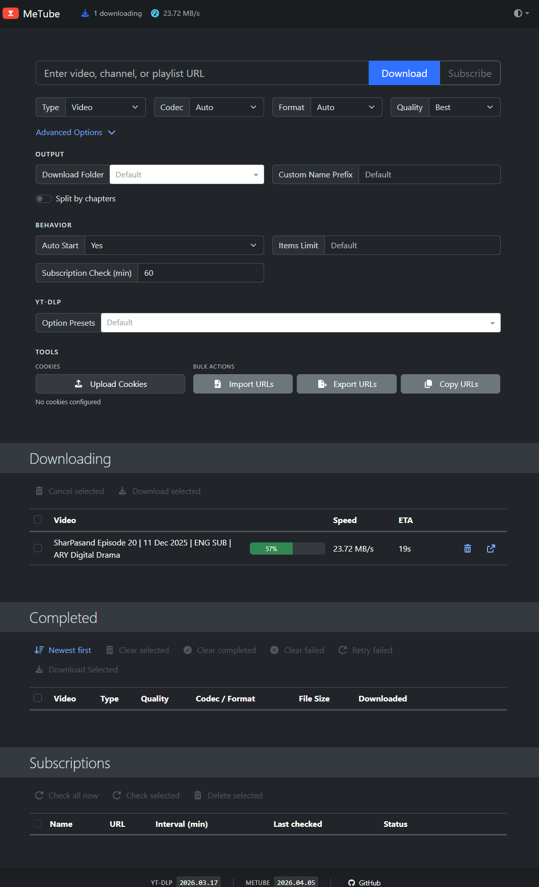

# MetubePlus

A self-hosted video downloader web app powered by [yt-dlp](https://github.com/yt-dlp/yt-dlp). Download videos and audio from YouTube and 1000+ other sites, subscribe to playlists with automatic polling, and watch real-time download progress in the browser.



## Features

- **Video & audio downloads** — single videos, channels, or playlists
- **Format picker** — Type / Codec / Format / Quality dropdowns with smart fallback format specs
- **Playlist downloads** — paste a playlist URL in the Download field and all videos are enqueued into a named subfolder automatically
- **Subscriptions** — subscribe to a playlist/channel and new videos are downloaded automatically on a configurable interval
- **Per-playlist folders** — each subscription and playlist download gets its own folder named after the playlist
- **Best quality by default** — uses `bestvideo*+bestaudio/best` with ffmpeg merging; gracefully falls back when filters are incompatible
- **Real-time progress** — live speed, ETA, and progress bars via WebSocket (Socket.IO)
- **Bulk actions** — checkboxes on every row; clear selected, clear completed, clear failed, retry failed
- **Sort & filter** — newest/oldest sort toggle on the Completed table
- **Open file** — click Open on any completed download to reveal the file in Explorer
- **Advanced options** — output folder, custom name profiles, auto-start, items limit, option presets, cookie upload, import/export URLs

## Prerequisites

Install these and make sure they are on your PATH:

| Tool | Version | Install |
|------|---------|---------|
| Python | 3.11+ | [python.org](https://www.python.org/downloads/) |
| Node.js | 20+ | [nodejs.org](https://nodejs.org/) |
| yt-dlp | latest | `pip install yt-dlp` |
| ffmpeg | any | [ffmpeg.org](https://ffmpeg.org/download.html) or `winget install Gyan.FFmpeg` |

> **Note:** ffmpeg is required for 1080p+ video quality (merging separate video+audio streams). Without it, downloads are limited to 720p progressive formats.

## Setup

### Backend

```bash
cd backend
python -m venv .venv

# Windows
.venv\Scripts\activate
# macOS / Linux
source .venv/bin/activate

pip install -e .
uvicorn app.main:socket_app --reload
# → http://localhost:8000
```

### Frontend

```bash
cd frontend
npm install
npm run dev
# → http://localhost:5173
```

Open **http://localhost:5173** in your browser.

## Project Structure

```
MetubePlus/
├── backend/
│   ├── app/
│   │   ├── main.py              # FastAPI + Socket.IO app factory
│   │   ├── config.py            # Settings (DB path, download dir, concurrency)
│   │   ├── db.py                # Async SQLAlchemy engine + session
│   │   ├── models.py            # ORM models
│   │   ├── schemas.py           # Pydantic DTOs
│   │   ├── events.py            # WebSocket event constants
│   │   ├── ws.py                # Socket.IO server + emit helpers
│   │   ├── routes/
│   │   │   ├── downloads.py     # Download CRUD + playlist endpoint + open-file
│   │   │   ├── subscriptions.py # Subscription CRUD + manual check
│   │   │   ├── metadata.py      # URL metadata resolution
│   │   │   ├── notifications.py # Notification list + mark-read
│   │   │   └── settings.py      # Key/value app settings
│   │   ├── services/
│   │   │   ├── download_manager.py    # ThreadPoolExecutor queue + progress relay
│   │   │   ├── subscription_worker.py # APScheduler polling jobs
│   │   │   └── notifications.py       # Notification creation helper
│   │   └── ytdl/
│   │       ├── service.py       # yt-dlp wrapper (metadata + download)
│   │       └── progress.py      # progress_hook → queue adapter
│   └── pyproject.toml
└── frontend/
    ├── src/
    │   ├── pages/Dashboard/     # Main UI (index.tsx + CSS Module)
    │   ├── api/                 # fetch wrappers for each backend route
    │   ├── ws/                  # Socket.IO client + event types
    │   └── styles/              # tokens.css, global.css, reset.css
    └── vite.config.ts           # Dev server with /api + /socket.io proxy
```

## Architecture

```
React Frontend (Vite + TypeScript + CSS Modules)
    ↓ REST (fetch)   ↓ Socket.IO
FastAPI Application (port 8000)
├── Download Manager  (ThreadPoolExecutor — keeps yt-dlp off asyncio loop)
├── Subscription Worker  (APScheduler AsyncIOScheduler)
├── Notification Dispatcher
└── Routes: /api/downloads  /api/subscriptions  /api/metadata
              /api/settings  /api/notifications
      ↓
SQLite via SQLAlchemy 2.x (async + aiosqlite)
      ↓
yt-dlp  (YoutubeDL class, not subprocess)
```

## WebSocket Events

| Event | Direction | Description |
|-------|-----------|-------------|
| `download:added` | server→client | Download enqueued |
| `download:updated` | server→client | Progress tick (~2/sec) |
| `download:completed` | server→client | Download finished |
| `download:failed` | server→client | Worker exception |
| `download:canceled` | server→client | User canceled |
| `subscription:checked` | server→client | APScheduler poll complete |
| `subscription:new_video` | server→client | New video detected |
| `notification:created` | server→client | Any notification |

## Configuration

Edit `backend/app/config.py` or set environment variables:

| Setting | Default | Description |
|---------|---------|-------------|
| `DB_URL` | `sqlite+aiosqlite:///./metubeplus.db` | Database path |
| `DOWNLOAD_DIR` | `./downloads` | Root download folder |
| `MAX_CONCURRENT_DOWNLOADS` | `3` | Parallel download workers |

## Design System

All visual tokens are in `frontend/src/styles/tokens.css`. No Tailwind, no CSS-in-JS — pure CSS Modules only.

| Token | Value |
|-------|-------|
| Background | `#0A0A0B` |
| Surface | `#141416` |
| Accent | `#7C5CFF` |
| Success | `#3FD97F` |
| Error | `#FF5C5C` |
| Font | Plus Jakarta Sans |

## License

MIT
